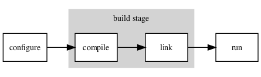
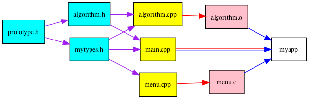

*****************
The Build Process
*****************

Introduction
============

Conceptually, the process of taking a completed source code and putting it to useful work can be split into 3 sections:

-  Configuration - finding the locations of any necessary supporting libraries and tools.
-  Building - Compiling the code and linking the combiled file objects into a working executable.
-  Running the file.

Configuring
===========

Linux packages often use tools called
`cmake <www.cmake.org>`__ or 
`autotools <autotools.io>`__ to simplify the task of finding libraries,
file paths and executables.

Autotools has existed for a considerably longer time. Autotools based installation instructions tend to look something like

::

   ./configure
   make

And contain files with names like ``Makefile.in`` or ``configure.ac``.

CMake is newer and somewhat more self-contained. CMake based installation instructions tend to look something like

::

   cmake .
   make

and contain files with names like ``CMakeLists.txt``. We'll return to CMake in a later section.

Compiling & Linking
===================

For the first section, we’ll just concentrate on the build step.

As a first pass, we can simply call the compiler by hand. Consider a simple "Hello World!" program written in C:

::

   #include <stdio.h>

   int main(int argc, char** argv){
     printf("Hello World!\n");
     return 0;
   }

On a generic unix-like system this can be built (with the default C compiler) with a command such as

.. code:: bash

   $> cc hello.c -o hello

Now we can run our new linked executable ``hello``.

.. code:: bash

   $> ./hello
   Hello World!

The Windows version
-------------------

On Unix-like systems the default C compiler is ``cc``, the default C++ compiler is ``c++`` and the linker is ``ld`` Note, as in the case we gave above, we can just call compiler and let it do the linking for us. This is frequently a good idea.

On Windows the compiler is ``cl.exe`` for both C and C++ code, The linker is ``link.exe``. We can configure ``.vcxproj`` files with ``msbuild.exe`` or ``devenv.exe``. See the `Microsoft
documentation <https://docs.microsoft.com/en-us/cpp/build/building-on-the-command-line?view=vs-2019>`__
for more information on command line compilation on Windows.

Compiler options
----------------

Operations get very complicated as you include more compiler options,
link to more source files, include more headers from non-standard paths
and link to more and more libraries. Consider the following example:

::

   cxx -DUSE_VTK=1 -I/usr/local/include -I/apps/vtk myfile.cpp \
    myotherfile.cpp another_file.o yetanotherfile.o \
    -O3 -g -ffast-math -lX -lm -L/usr/lib/vtk-5.10 \
    -lvtkCommonCore -lpng -o myfile

Here we’re using various compiler options: - - The ``-D`` sets macro values for
``#ifdef`` etc. In the example, the macro symbol USE_VTK now has the value 1.
- The ``-I`` adds a directory to the list used to search for header files
- The ``-L`` adds a directory to the search path using when looking for libraries
- The ``-O3`` specifies compiler
optimizations (we've chosen the maximum)
- The ``-g`` leaves symbols (i.e. function and variable names) in the executable for later use when debugging.
- The ``-lpng`` links in the ``libpng`` library (using the shared ``libpng.so`` version by default).

Code units must also be rebuilt *in order* as their dependencies are
updated.

This is a lot of stuff to remember (and to type) every time. It would be much nicer to automate this out.

A shell script version
----------------------

A halfhearted attempt will put commands in a text file, say``compile.sh``

::

   #!/usr/env bash

   cxx -DUSE_VTK=1 -I/usr/local/include -I/apps/vtk myfile.cpp \
    myotherfile.cpp another_file.o yetanotherfile.o \
    -O3 -g -ffast-math -lX -lm -L/usr/lib/vtk-5.10 \
    -lvtkCommonCore -lpng -o myfile

If we use ``chmod u+x compile.sh`` once to turn this shell script into something we can execute, then we can run
::

   ./compile.sh

to build our file. This saves our fallible human memories, but isn't very robust on different platforms and would require us to recompile every file every time we link the executable. This wastes work, and can take a surprisingly long time. We can do much better.

GNU Make
--------

A program to build programs
^^^^^^^^^^^^^^^^^^^^^^^^^^^

The GNU tool ``make`` uses recipes from text files, called
``Makefile``\ s to automate and control the build process.

Basic online help is available at the command line via  ``make -h``, ``man make`` or
``info make``, depending on what's installed on the system you are using and the level of detail you are interested in. Unfortunately, there aren't many circumstances in which they are useful.

The original ``make`` was created by Stuart Feldman in April 1976 at Bell
Labs.

Windows has its own version called ``nmake``

Gnu ``make`` and windows ``nmake`` not really very compatible, due to
things like ``-I`` versus ``/I``.

\_Make originated with a visit from Steve Johnson storming into my
office, cursing the Fates that had caused him to waste a morning
debugging a correct program (bug had been fixed, file hadn’t been
compiled, cc \*.o was therefore unaffected).\_

*As I had spent a part of the previous evening coping with the same
disaster on a project I was working on, the idea of a tool to solve it
came up.*

— Stuart Feldman, The Art of Unix Programming, Eric S. Raymond 2003

A ``Makefile`` consists of a list of ``target``\ s, listing the
dependency structure, along with recipes to build each target from its
prerequisites.

The general syntax is

::

   # Lines starting with # are comments
   <target name> : prerequite1 [prerequite2 ...]
       recipe line 1
       [recipe line 2]
       [...]

as a trivial example:

::

   biscuit:  eggs.cpp flour.cpp sugar.cpp
       $(CXX) eggs.cpp flour.cpp sugar.cpp -o biscuit

Run the command to build the biscuit target as

::

   make biscuit

(or just ``make`` to build default target, usually first one) - By
default, recipe lines must start with ``tab`` characters, NOT spaces. -
Variables are referenced with ``$(variable_name)`` or
``${variable_name}`` - Defaults to run each line in its OWN subshell.

Can get faster rebuilds by storing intermediate files

::

   eggs.o: eggs.cpp
       $(CXX) eggs.cpp -c

   flour.o: flour.cpp
       $(CXX) flour.cpp -c

   sugar.o: sugar.cpp
       $(CXX) sugar.cpp -c

   biscuit:  eggs.o flour.o sugar.o
       $(CXX) eggs.o flour.o sugar.o -o biscuit

.. _gnu-make-a-program-to-build-programs-4:

Now if we change ``flour.cpp``, and run

::

   make biscuit

-  Only the ``flour.o`` object file will be recompiled.
-  The executable ``biscuit`` is still relinked.

Make has a *lot* of default recipes installed with it.

-  May or may not do what you wanted.
-  Often cause confusion about why things broke.
-  If in doubt, we recommend writing things more explicitly.

Make variables
--------------

Make variables can be:

-  Set in the Makefile itself as ``VARNAME=<value>`` (no tabs)
-  Set at the command line with ``make CXX=icc``
-  Inherited from the environment (eg. an earlier
   ``export VARNAME=<value>``)

.. _make-variables-1:

-  Some variables like ``${CC}``\ come with preassigned with default
   values (usually GNU tools such as gcc).
-  Tools like CMake and autotools build up variables to build Makefiles.

Make functions
--------------

As well as variables, ``make`` has functions.

The syntax is very similar

::

   $(<function name> <arg1> [<arg2> ...])

To collect a list of all functions ending ``.cpp``:

::

   SRC_FILES = $(wildcard src/*.cpp)

To get a list with the ``.cpp``\ s replaced with ``.o``\ s:

::

   OBJ_FILES = $(patsubst %.cpp,%.o,${SRC_FILES})

Common target names
-------------------

Some target names have become “standard” in Makefiles:

-  ``all`` is usually set to depend on all final outputs (so everything
   gets built)
-  ``install`` copies files as necessary to install the project
-  ``clean`` deletes any built targets etc.

::

   INSTALL_DIR = "${HOME}/bin"

   all: myapp mytools;

   install:
       cp myapp $(INSTALL_DIR)

   clean:
       rm -rf src/*.o myapp mytools

Forcing rebuilds
----------------

Difficulties if you have a text file called ``install`` with
installation instructions & an ``install`` target.

Make may think target is up-to-date, so nothing to do.

Fix this by adding a line

::

   .PHONY: install

Tells ``make`` that install doesn’t really produce output, & should
always run.

Running multiple recipes at once
--------------------------------

``make`` has an option ``-j`` to run multiple recipes at the same time.

Eg. to allow up to 4 jobs at once

::

   make -j4 all

Since targets must wait for their dependencies to be built, this may not
speed things up much.

Building on HPC
---------------

-  load module files *before* calling ``make``.
-  Can call ``make`` inside a batch scheduler script, but don’t generally want
   to run it using ``mpiexec``.
-  Often want a short serial queue.
-  If using the ``$TMPDIR`` variable, remember to copy back/install your
   output.

::

   #PBS -N make_example
   #PBS -l walltime=0:30:00
   #PBS -l select=1:ncpus=1:mpiprocs=1:mem=1800mb

   module load intel-suite
   module load mpi
     
   export CXX=mpicxx
   export CC=mpicc
    
   cd mypackage
   ./configure
   make clean
   make

Further reading
---------------

-  A longer tutorial from `software carpentry <https://swcarpentry.github.io/make-novice/>`__
-  (too much) documentation: `the make manual <https://www.gnu.org/software/make/manual>`__
